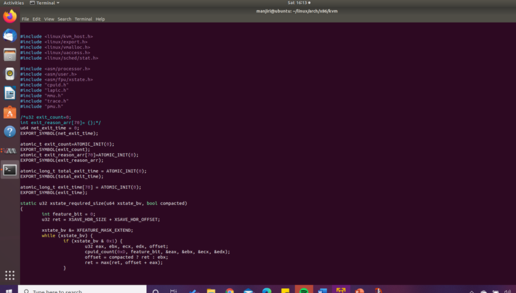
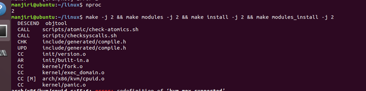
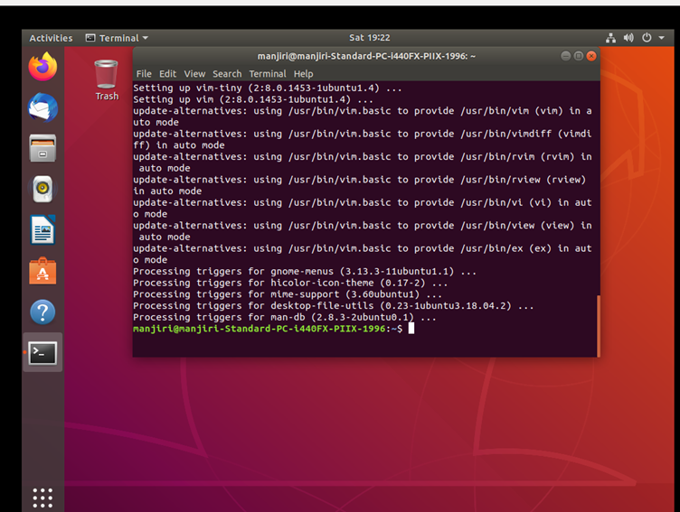
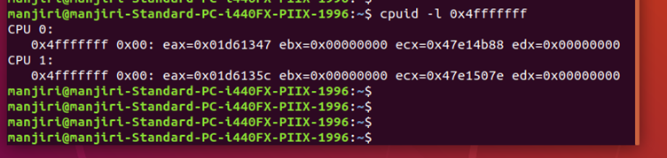
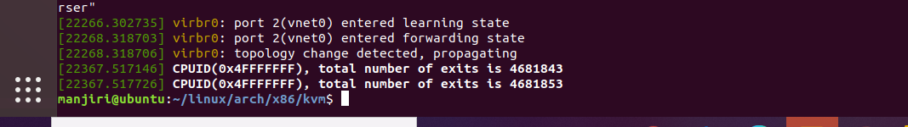

# CMPE283 : Virtualization Technology
# Assignment 3 : Instrumentation via hypercall

 

#### Student names: Manjiri Kadam, Pranjali Kotgire
#### University Name: San Jose State University

### Prerequisites
• You will need a machine capable of running Linux, with VMX or SVM virtualization features exposed.
You may be able to do this inside a VM, or maybe not, depending on your hardware and software
configuration. You should likely be using the environment you created for assignment 2.

## Question 1:
### Assignment Contribution of each Team Member
#### Pranjali Kotgire 

1. Completed the code for CPUID leaf node %eax = 0x4FFFFFFE part with Manjiri
2. Utilised the setup we implemented for assignment 2.
3. Modified the cpuid.c and vmx.c file on extension to the assignment 2
4. Recorded Answers for asked questions.

#### Manjiri Kadam
1. Refered the ppt and lecture. Learned about exits with help of SDM
2. Modified the cpuid.c and vmx.c file on extension to assignment 2.
3. Noted the number of exits and output by running test files and recorded the output in readme.md file along with the screenshots.
4. Answered the asked question.

Please Refer to Assignment 2, as we have used the same enviroment for Assignment 3
[Check out git link]("https://github.com/Manjiri1101/283_VirtualizationTechnologies/tree/master/Assignment2")

## Question 2:
### Steps Performed For Assignment:
1.To calculate the total time spent processing all exits and the time spent processing the exit number for the particular case, we made changes in vmx.c file and cpuid.c file.

2.Then compile and build the modules using following commands:

`nproc`
`make -j 4 && make -j 4 modules / make -j 2 && make -j 2 modules` (depends on proc value)

3.Install the modules using below commands:

`make modules_install && make install `

4.Install cpuid package in the inner VM:

`sudo apt-get install cpuid`

5.Check the total exit time in the Inner VM

6. Checked dmesg from VM

## Question 3:
### Comment on the frequency of exits – does the number of exits increase at a stable rate? Or are there more exits performed during certain VM operations? Approximately how many exits does a full VM boot entail?

1. The total exit time is increasing and High 32 bit of total time spent on processing is 0 as time spent in processing exits is very minimal. 
2. Low 32 bit has been captured in %ecx.
3. The frequency of number of  exits are not increasing at a constant rate . 
4. We can observe that VM boot for exit 28 entails up to 46k exits after full boot.

Thank You.

