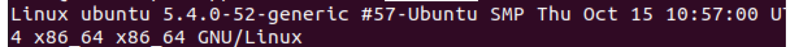
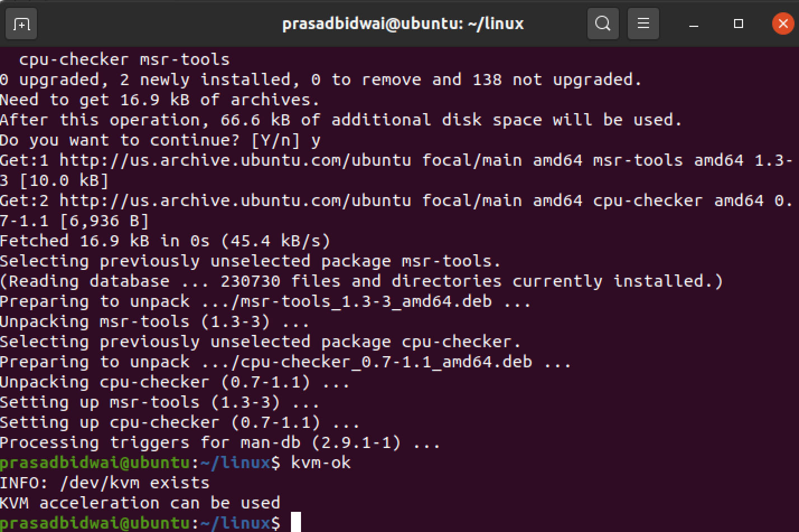
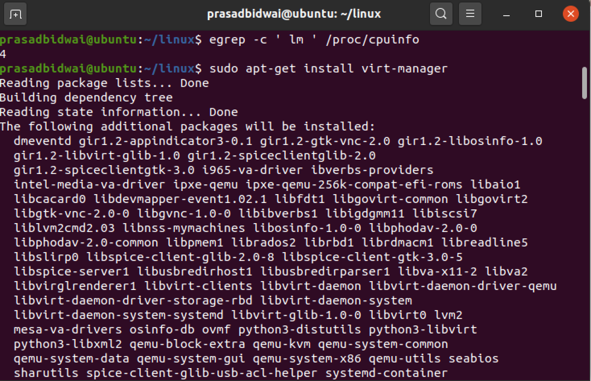

# CMPE283 : Virtualization Technology
# Assignment 2 : Modifying instruction behavior in KVM

#### Student names: Manjiri Kadam, Pranjali Kotgire
#### University Name: San Jose State University

### Prerequisites
• You will need a machine capable of running Linux, with VMX or SVM virtualization features exposed.
You may be able to do this inside a VM, or maybe not, depending on your hardware and software
configuration. You should likely be using the environment you created for assignment 1.

## Question 1:
### Assignment Contribution of each Team Member
#### Pranjali Kotgire
1. Examine kernal source code and build kernal.
2. Set up required environment to run expected functionality.
3. Tried to understand and study about leaf function.
4. Studied overall exit flow, cpuid exit handler and determined to change cpuid.c file. In cpuid.c modified kvm_emulate_cpuid function if eax == 0x4FFFFFFF. along with this I extended variables in cpuid.c file.
5. Worked on installation of a VM using virt-manager.
6. Output verification
7. worked on documentation.

#### Manjiri Kadam
1. Examine kernal source code and build kernal.
2. Set up required environment to run expected functionality.
3. Tried to understand and study about leaf function.
4. Tried to understand vmx_handle_exit function in vmx.c and wrote code in this function and declared global variables in same file.
5. Worked on installation of a VM using virt-manager.
6. Output verification
7. worked on documentation.

Your assignment is to modify the CPUID emulation code in KVM to report back additional information
when a special CPUID “leaf function” is called.
• For CPUID leaf function %eax=0x4FFFFFFF:
◦ Return the total number of exits (all types) in %eax
◦ Return the high 32 bits of the total time spent processing all exits in %ebx
◦ Return the low 32 bits of the total time spent processing all exits in %ecx
▪ %ebx and %ecx return values are measured in processor cycles
At a high level, you will need to perform the following:
• Configure a Linux machine, either VM based or on real hardware. You may use any Linux
distribution you wish, but it must support the KVM hypervisor.
• Download and build the Linux kernel source code (see below)
• Modify the kernel code with the assignment functionality:
◦ Determine where to place the measurement code
◦ Create new CPUID leaf 0x4FFFFFFF
▪ Report back information as described above
• Create (or otherwise locate) a user-mode program that performs various CPUID instructions
required to test your assignment
• Verify proper output

## Question:2
#### Steps that we used to complete the assignment
#### How we built the kernel:
Please follow the steps:

First of all make sure in the flags, VMX capability is there using `cat /proc/cpuinfo|more`. If you can see VMX capability then CPU has been set up properly.

1)We followed the steps to install the VM, then Ubuntu on our Windows / Mac PC. Installed ISO - Ubuntu 18.5, allocated disk space of 250 GB.

2) We have cloned the Linux github repository, using following command;
  `git clone https://github.com/torvalds/linux.git `
  
3) We followed the insructions given in the Assignment pdf to build kernel.

 Checked the Linux Version (old):
 `uname -a`
 
 
4) Installed the dependency;
 `sudo apt-get install build-essential kernel-package fakeroot libncurses5-dev libssl-dev ccache bison flex libelf-dev`
 
5) Noted the kernel Version by using - `uname -r` which was: 

7) `cd linux`

8) `cp /boot/config-$(uname -r) ./.config ` Replace (uname -r) eg- ` cp /boot/config-5.4.0-52-generic ./.config `

9) ` sudo make oldconfig ` (and then just use the default for everything, don’t change anything – you can do this by holding down enter)

10) Runthe following instruction in "Linux" folder one by one:
`sudo  make` ,  `sudo make modules` , ` sudo make install`  and `sudo make modules_install` 
These steps might need 4-6 hours to complete for the first time.

11) Then reboot the Ubuntu machine:
` sudo reboot`

12) Verify that you are using the newer kernel (5.8, etc) after reboot: `uname -a`

**Note :After executing these priliminary steps, we can edit the code. After changing the code in KVM for the assignment, you can rebuild using the same “make” sequence of
commands above (and it should only take a few minutes, not several hours).

#### Modify the kernal code
 we have modified vmx.c and cpuid.c file and after modification we need to rebuild the kernal using make command.
 

                                                   
                                                    
#### Updating the KVM:
Please run the following commands one by one (root user)
1) `kvm-ok`

2) `sudo apt install cpu-checker`

3) `egrep -c ‘lm’ /proc/cpuinfo`

4) `sudo apt-get install virt-manager`

#### verify output:
on vm install cpuid: `Sudo apt install cpuid`
Test output using cpuid command:`cpuid –leaf=0x4FFFFFFF`

## question:3
#### Comment on the frequency of exits – does the number of exits increase at a stable rate? Or are there more exits performed during certain VM operations? Approximately how many exits does a full VM boot entail?

1.We observed that during the VM boot, number of VM exits increase drastically untill VM gets stable and they increase gradually after we fire cpuid –leaf=0x4FFFFFFF command from VM.

2. around 60,00,000 exits we observed during the booting process of VM.

#### Modified the cpuid.c and vmx.c files, ran the commands: "make && make modules && make install && make modules-install" as root user. It ran successfully. 
Please check the attched files

Thank you.
